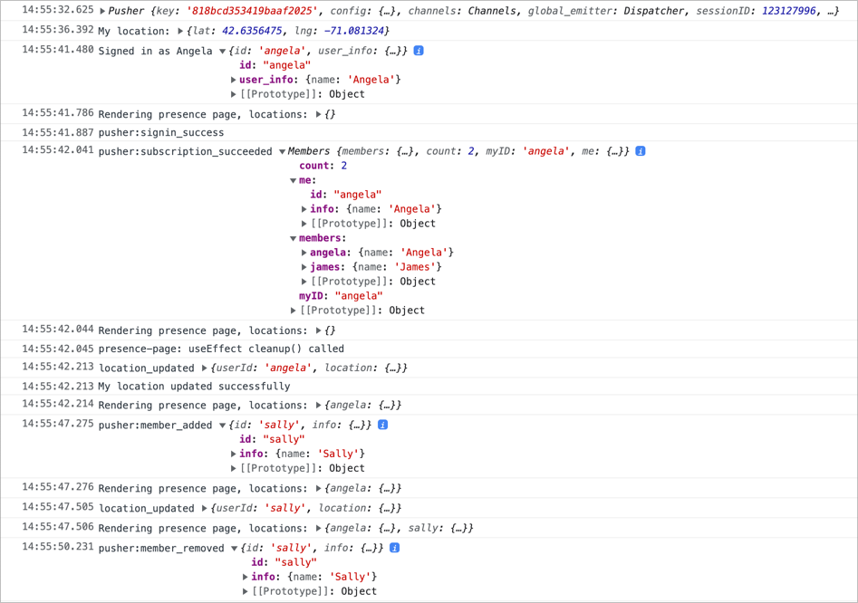

# Pusher Next.js Location

Demonstrates the use of Pusher presence channels to show the realtime locations
of signed in users.


Here are the logs showing the sequence of pusher events:



Application can be tested by sending `location_updated` events using Pusher's
debug console. Here's a sample `location_updated` event:

```json
{ "userId": "james", "location": { "lat": 37.7749, "lng": -122.4194 } }
```


## Development Build

Copy `.env.sample` to `.env.local` and update with correct values for your
Google Maps and Pusher accounts.

```shell
npm ci
npm run dev
```

Now point your browser to http://localhost:3000 and sign in. This should show
your location on the map. In a production environment, multiple users can sign
in and all their locations will be seen.

### Production Build

```shell
npm run build
npm start
```
